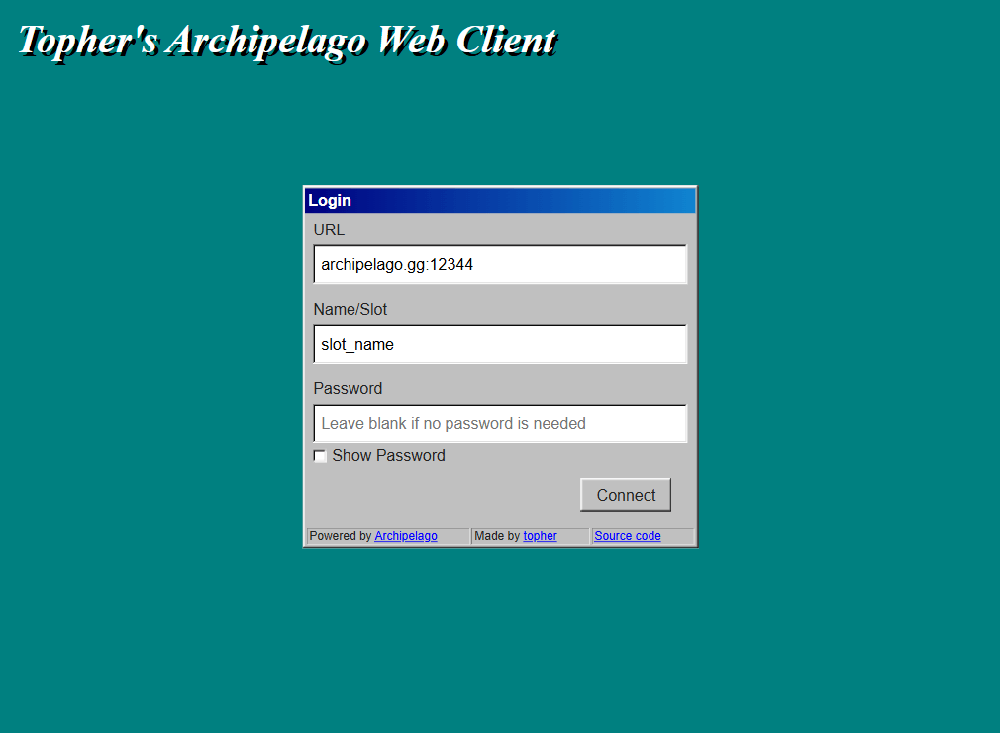
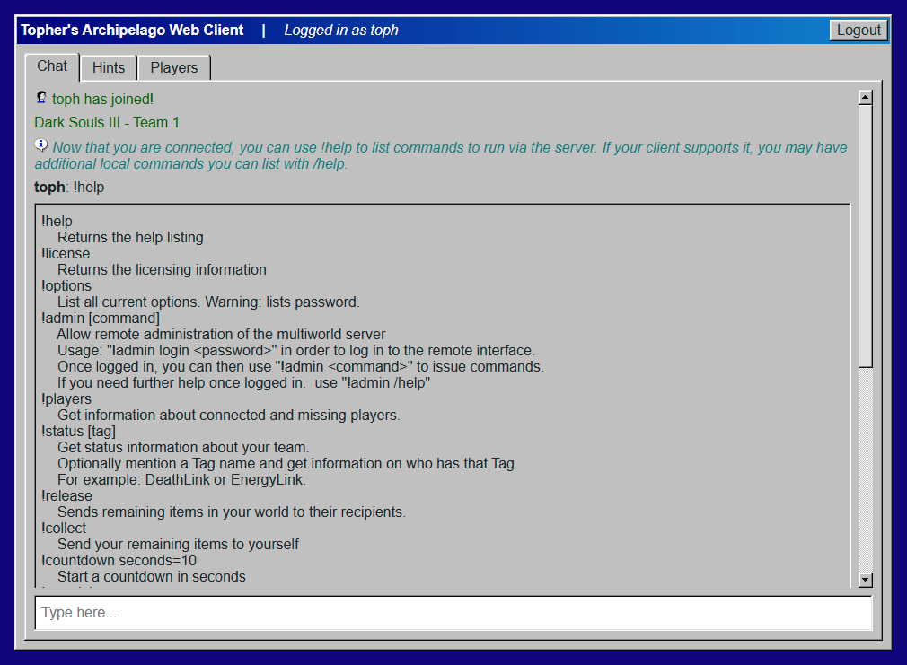
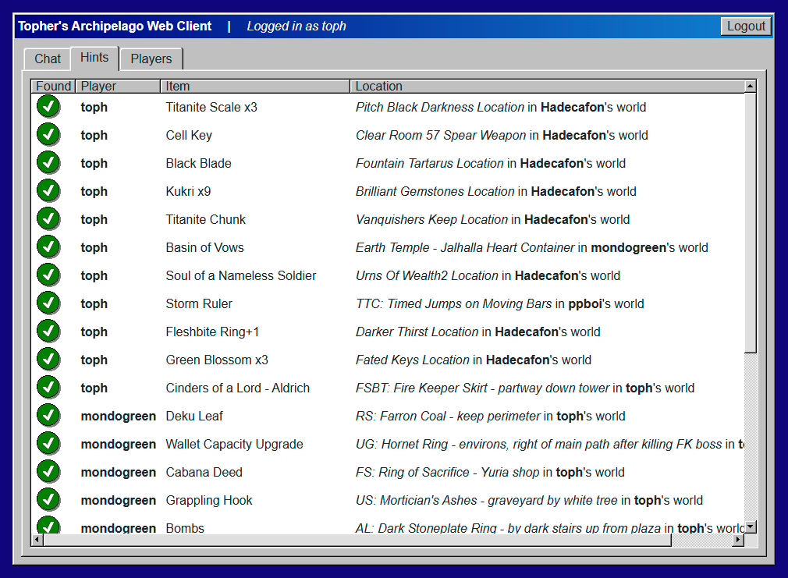
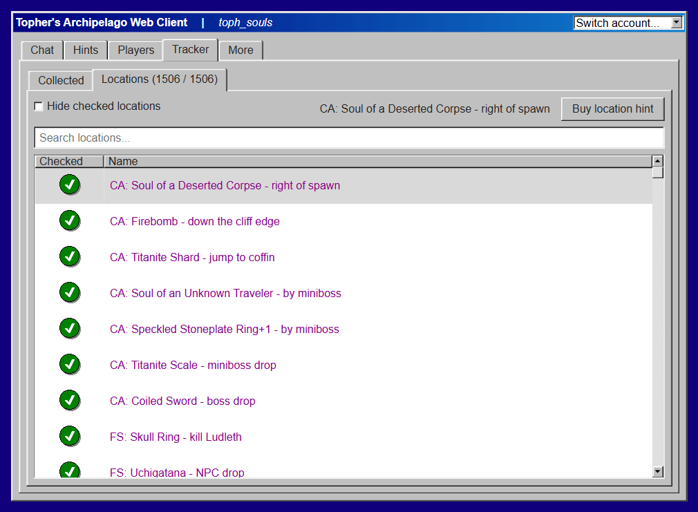

# Topher's Archipelago Web Client

[https://topheranselmo.com/archipelago/](https://topheranselmo.com/archipelago/)

|    |    |
:-------------------------:|:-------------------------:
  |  
  |  

My goal with this project is to provide a nice way to chat with other players in an Archipelago instance from any web capable device.

Features:

- Mobile browser support
- Messages are parsed & color coded nicely
- Saves previously entered information for future visits
- Can automatically resume connections after refreshing
- Supports basic markdown bolding and italics for user chat messages
- Automatically converts URLs in user chat messages to clickable links
- Well formatted & sortable hints table
- Sortable users table that shows current player status (connected, completed, etc.)
- Message recall by pressing the up arrow
- Integrated sortable tracking table for collected items and location checks
- Automated item hint buying through UI

Libraries:

- [archipelago.js](https://github.com/ThePhar/archipelago.js)
- [98.css](https://github.com/jdan/98.css)
- [vue](https://github.com/vuejs/core)